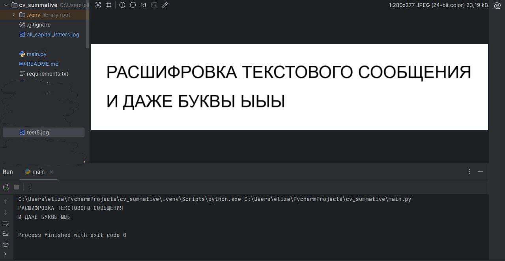
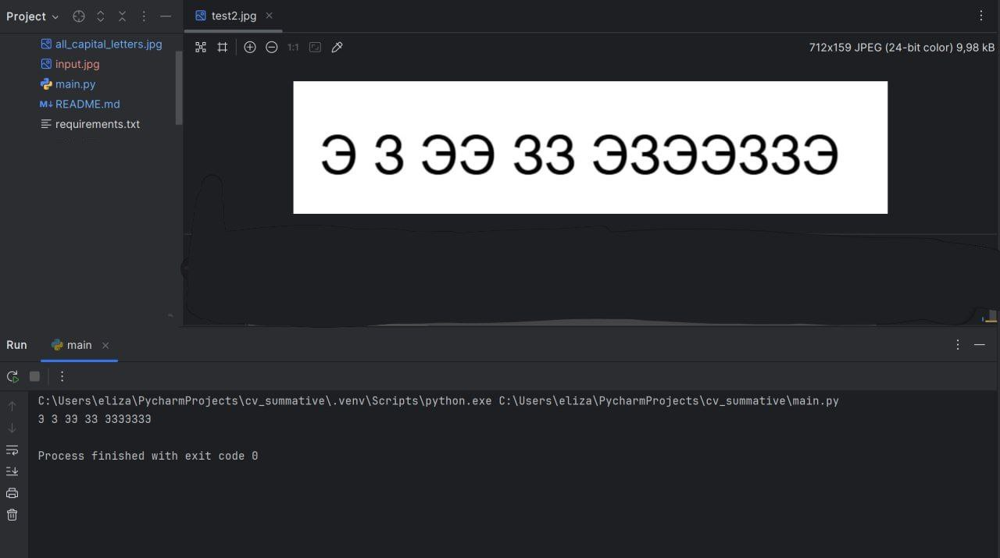

# image to text
**Название проекта:** image to text

**Описание проекта:** 
Основной целью проекта является распознавание текста на изображении. Это необходимо, например, для копирования текста с фотографии листа бумаги или экрана, где копирование невозможно.

**Установка:**
1. Загрузить проект с github на свое устройство
2. Использовать файл requirements.txt, указанный в проекте для установки всех необходимых библиотек командой
pip install -r requirements.txt

**Использование:**
Чтобы считать текст с изображения переместите его в папку с проектом (туда же где лежит файл main.py) Примеры изображений, которые можно использовать для тестирования расположены на github:
all_capital_letters.jpg, test1.jpg

**Примеры:**
Вот один из примеров работы программы, на вход подается изображение test5.jpg, программа выводит текст написанный на изображении:

Другой пример (test2.jpg) демонстрирует работу программы в более сложной ситуации (различение Э и З):

**Статус проекта:**
Почти завершен. Пока возможно только распознание заглавных букв на белом фоне.